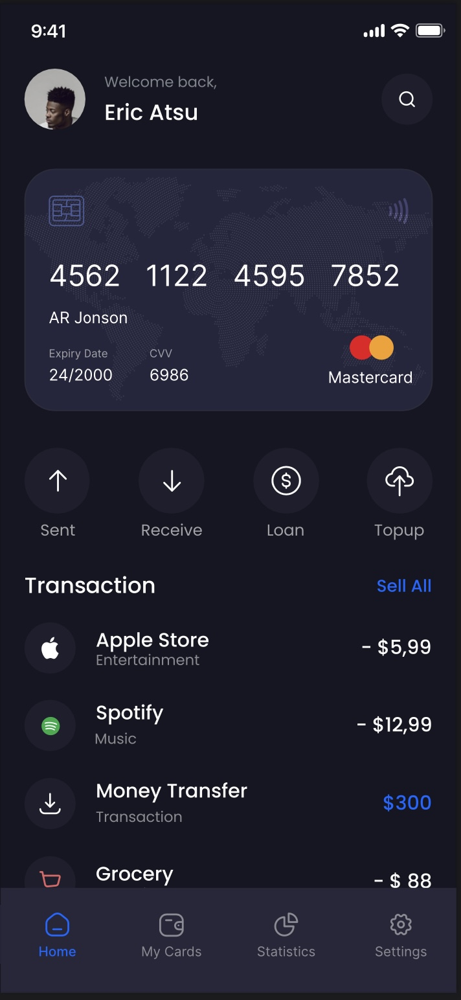
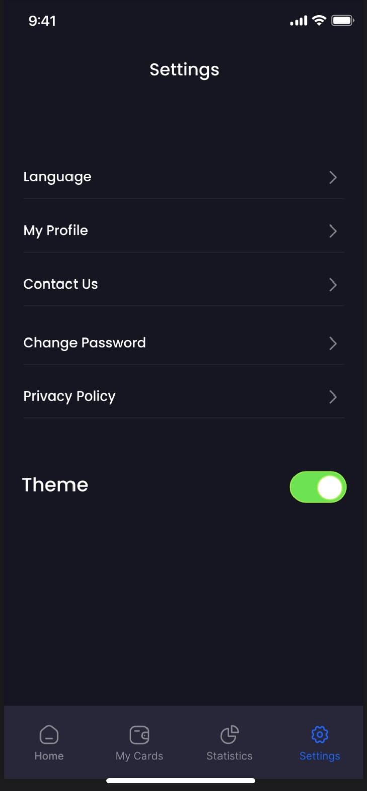
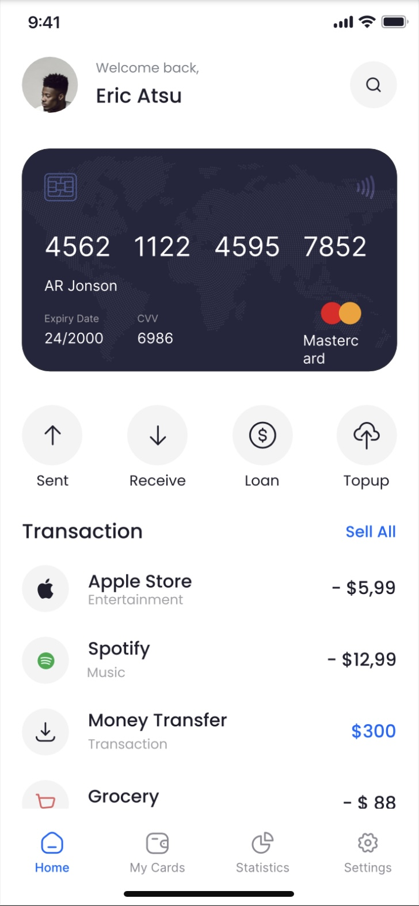
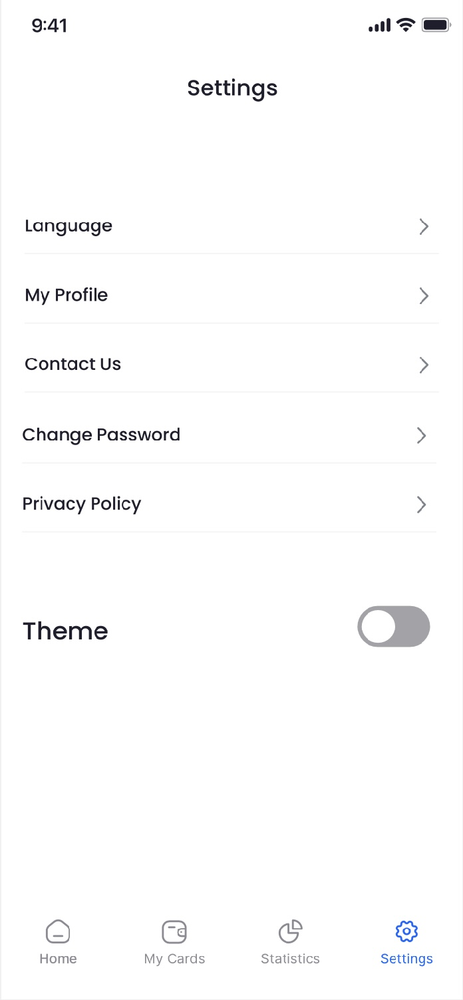

# rn-assignment5-11026285

## Description
This mobile application is developed as a part of the assignment to recreate a UI mockup using React Native. The application includes the following features:
- Bottom tab navigation with Home and Settings screens.
- Light and dark theme switching functionality.
- Custom components styled to closely match the provided UI design.

## Features
1. **Bottom Tab Navigation**: 
   - Home Screen
   - Settings Screen
   - Additional Screens as per the design
   
2. **Theme Switching**: 
   - Users can switch between light and dark themes.
   
3. **Custom Components**: 
   - Reusable components styled according to the UI mockup.

## Screenshots
[   ]

## Installation and Setup
1. **Clone the Repository**:
   git clone https://github.com/your-username/rn-assignment5-11026285.git
   cd rn-assignment5-11026285

2. **Install Dependencies**:
   npm install

3. **Run the Application**:
   npx react-native run-android  
   npx react-native run-ios    

## File Structure
- assignment5
  - App.js
  - theme
    - ThemeContext.js
  - screens
    - HomeScreen.js
    - SettingsScreen.js
    - TransactionsScreen.js
    - ProfileScreen.js
  - components
    - CustomComponent1.js
    - CustomComponent2.js
  - assets
    - [images, icons, etc.]

## Implementation Details
- **Home Screen**:
  - Implemented with a layout that matches the UI design.
  
- **Settings Screen**:
  - Includes a switch to toggle between light and dark themes.
  
- **Theme Switching**:
  - Utilizes Context API to manage and provide theme state across the application.
  
- **Styling**:
  - Applied custom styles to ensure the application closely matches the provided UI mockup.

## Resources
- **UI Design**: [UI Design Link]
- **Application Resources**: [Google Drive Link]

## Commit History
- **Task 1**: Initial project setup and bottom tab navigation.
- **Task 2**: Implemented Home and Settings screens.
- **Task 3**: Added theme switching functionality.
- **Task 4**: Styled application to match UI design.
- **Task 5**: Added custom components.

## Author
- **Name**: Joseph Boamah
- **Email**: [jfboamah@st.ug.edu.gh]
- **GitHub**: [https://github.com/josephboamah11026285]

